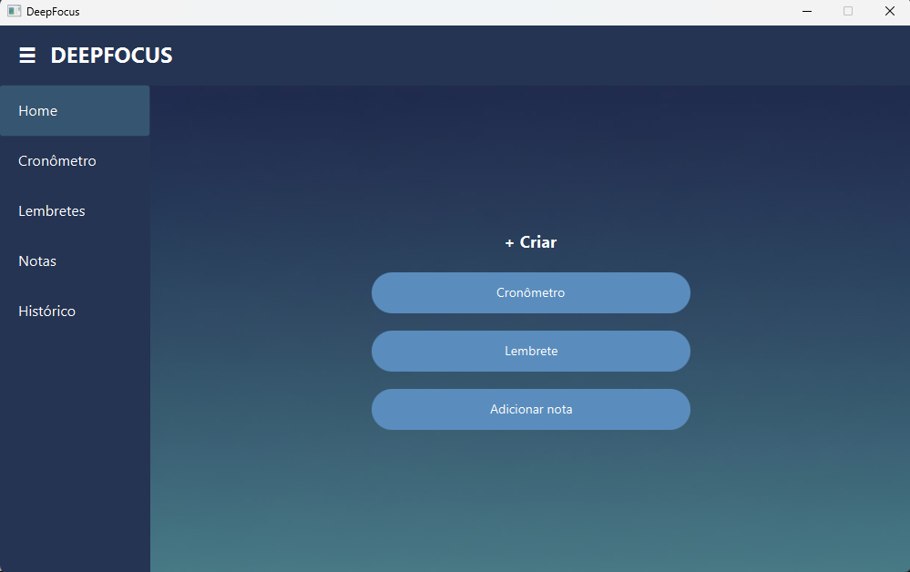
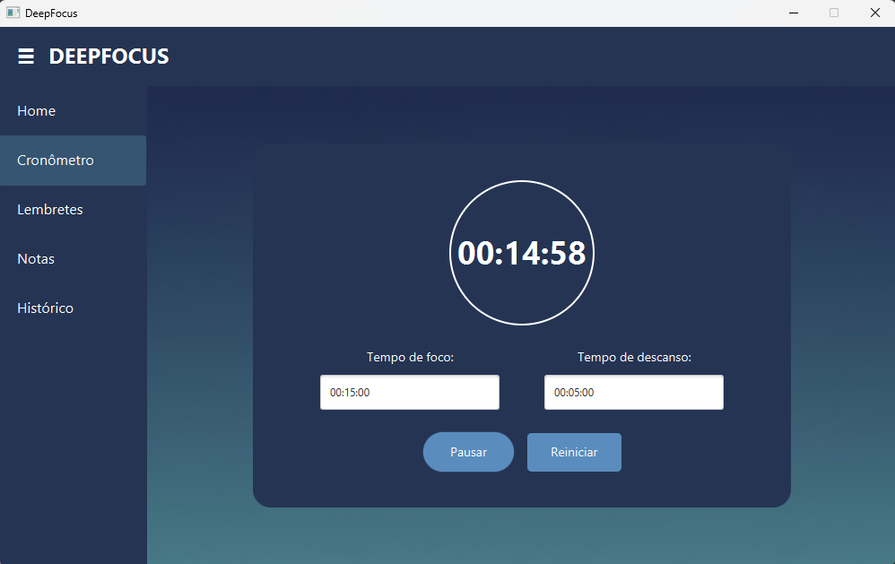
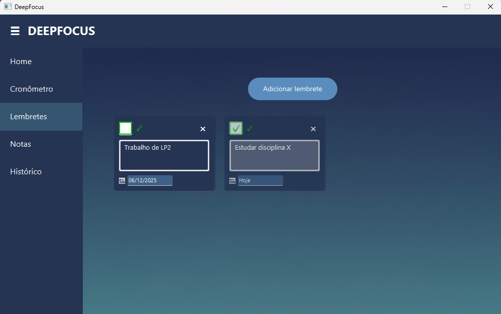
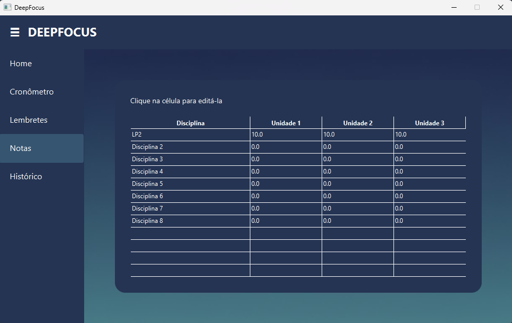
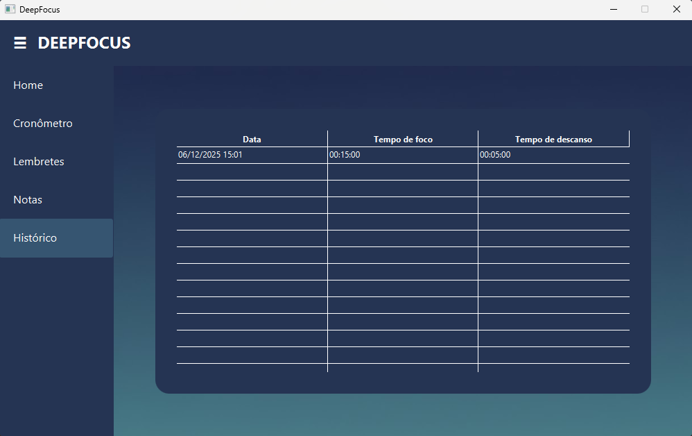

# DeepFocus
Disciplina: Linguagem de Programação II  
Semestre: 2025.2  
Professor: João Anísio  
  
Integrantes do Grupo:  
Theo Campos Soares (20240016648)  
Yasmin Maria Lima Aires de Carvalho (20240013181)  
Descrição do Projeto:  
Interface gráfica focada na organização de uma rotina de estudos.  
  
Guia de Instalação e Execução  
  
1. Instalação das Dependências  
Certifique-se de ter o Java 25.0.1 e o Maven 3.9.11 instalados.   
  
# Clone o repositório ou baixe o zip no Github  
git clone [https://github.com/yasmin-30/DeepFocus.git](https://github.com/yasmin-30/DeepFocus.git)  
  
# Entre na pasta do projeto  
cd DeepFocus  
  
2. Como Executar  
Execute os comandos abaixo no terminal para iniciar:  
  
mvn clean compile  
mvn javafx:run  
  
Estrutura dos Arquivos:  
  
data/  
Arquivos que armazenam informações persistidas pelo sistema:  
  
tarefas.json — Lembretes criados pelo usuário  
notas.json — Notas escritas  
historico.json — Sessões de Pomodoro concluídas  
  
src/main/java/  
Código-fonte principal dividido em pacotes:  
  
controller/  
 Controladores da interface (ex.: classes que lidam com eventos da UI).  
modelos/  
 Classes que representam os dados do sistema (Tarefa, Nota, Pomodoro etc.).  
persistence/  
 Leitura e escrita de arquivos JSON.  
services/  
 Regras de negócio (gerenciamento de tarefas, notas, histórico, pomodoro).  
utils/  
 Funções auxiliares usadas para o cronômetro das sessões Pomodoro (TimerUtil).  
   
Main.java  
 Ponto de entrada da aplicação (JavaFX).  
   
src/main/resources/  
Arquivos usados pela interface ou pelos controllers:  
  
assets/ — Ícones, imagens, logos  
view/ — Arquivos FXML  
styles.css — Estilos da interface  
  
Prints da interface:  

